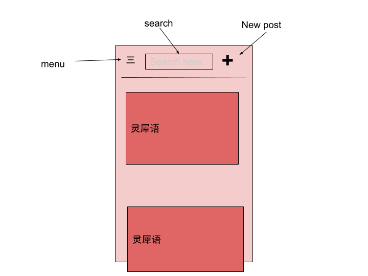
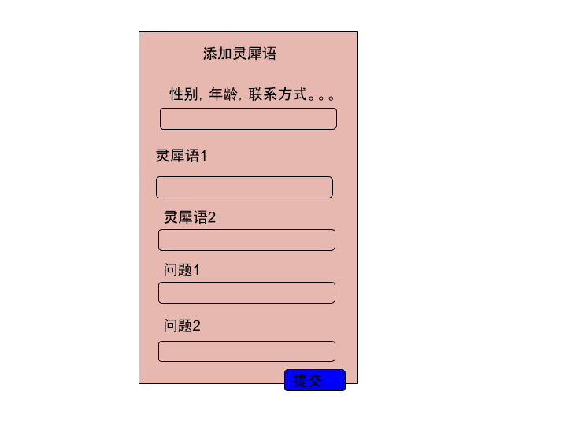

**Author: swortal@gmail.com**

# Features
## Basic Pattern
Allow user to post some short contents and respond to other users’ posts and connect them. 
## Detailed Features
Users are categorized to posters and responders.  
Poster makes post. Each post contains a frontside and a backside. On frontside, poster can post 2 - 3 short statements about "Your love philosophy", "About yourself" and "What do you wish him to do for you?".  On backside, poster can ask 2 questions. A default question of "Anything more?" will be appended to the backside also.  
Responder reads and answers posts. If a responder is interested in the frontside content, he can click the post and see the backside. Then he can answer the questions with short sentences. The answers will be sent to the poster together with the responder's email. If the poster is interested in the answers, he can contact the responder. 
## Advanced Features
- Allow poster to customize post content, background, appearance and so on.
- Provide responder with more post search option and filtering features.
- Develop a recommendation algorithm for responder. 

## Major Platform
The major platform is Mobile because people use social media on mobile devices much more. We will also support PC platform.

# Business Model
- Post: customizable and multiple 灵犀语; customizable and multiple questions; other configs; email
- Response: answers; email
- Responder: search & recommendation preference
- User: posts, preference, email, location

# Technical Requirements
## Estimated Metrics
- 140 Chinese characters per post = 520 bytes per post.
- 40 - 50 Chinese characters per answer = 150 bytes per post.
- 1k - 10k users (Bay area single chinese people) 
- Each user has 2 - 3 posts in 1 year => 3 * 10k users * 520 bytes post = 15 MB new post data per year
- Each user answers 10 posts per year => 10 * 10k * 150 =  15MB new answer data per year
- Each user answers each posts after reading 20 posts, each post is read by same user at most 3 times => 600 post read per user per year => 600 * 10k * 520 bytes = 3.1gb data throughput per year => <10 mb per day
## Consistency vs Latency
The data consistency needs for this app is pretty small because:
- This app doesn't involve money or any other types of business transactions.
- The post doesn't need to be updated over time. The poster can create a new post as he likes. 
- The responder couldn't update his answer because the answer will be sent to the poster as soon as he submits it.   

So low latency of viewing posts is a major need. 

## Possible Queries
- Poster：View all my posts; all responses to my posts
- Responder: search post by gender, keyword in post content, other poster attributes; view all my responses and responded posts; 
- Posted response couldn’t change, so it is easy to do denormalization, responder should rarely query his all response, so it is fine to be slow
- Recommender: collaborative filtering, a feature hash for each user and calculate the distance between each user 
- Read and write configuration

# Technical Design
## Database
**We choose Mongodb for our app.**  
Justification:  
**Why nosql over sql?**
- Amazon’s nosql vs sql comparison [1](https://docs.aws.amazon.com/amazondynamodb/latest/developerguide/SQLtoNoSQL.WhyDynamoDB.html), [2](https://aws.amazon.com/nosql/)
- Nosql is suitable for Web-scale applications, including social networks, gaming, media sharing, and Internet of Things (IoT) while sql is suitable for Ad hoc queries; data warehousing; OLAP (online analytical processing). Our app is a social media, so Nosql is more suitable.
- Flexible schema structure, we can easily update post and answer’s template or use different templates.
- According to possible queries above, most queries are around post. So tree structure of post with multiple children responses is a better fit for our case. SQL join is more complicated and less performant for our case.
- We don’t have strong consistency and ACID requirement. So SQL doesn’t help here. 

**Why Mongodb?**
- Mongodb supports multi-level indexes. We can index posts and answers and improve related query performance.
- Mongodb is JavaScript based which is easy for beginner.
- Mongodb uses JSON data as schema type which is easy to integrate with frontend. 
- Mongodb has a sophiscated aggregation pipeline which can be used to join different schema in case we need in the future.

### Schema
    "Post": {
        "CreationTime": “timestamp”,
        “Id”: “postId”,
        “posterId”: “UserId”,
        “灵犀语”: [{
                    “Label”: “String”;
                    “Content”: “String”;
                 }...],
        “Questions": [“String”...],
        "Responses": [{
                    “responderId”: “UserId”,
                    "Answers": [String...] // In same order of questions
            	}]
        }

    “User”: {
        “contact”: “email...”,
        “Id”: “UserId”,
        “Gender”: “enum”,
        “Posts”: [“PostId” ...],
        “RespondedPosts”:[“PostId”...]
    }

## Data protocal
We use [Protocol Buffer](https://developers.google.com/protocol-buffers) + [Grpc](https://grpc.io/) as the common data protocal among frontend, backend and database.
- Protocal Buffer is smaller, faster and simpler version of XML which allows us to clearly define protocal object's field types and reduce ambiguity.
- Protocal Buffer can be compiled to different programming languages which makes parsing easier in different languages.
- Protocal Buffer can serialize data to JSON which is compatible with Mongodb.
- Grpc is a common rpc framework to simplify the calling between different system.

## Backend Stack
Since Mongodb has a tight relationship with Javascript, we use Nodejs as backend server. We use Expressjs as backend framework because it is a neutral framework which allows us to go with any pattern instead of enforcing some pattern. 

## Programming Language
We use TypeScript as the only programming language. TypeScript is typed Javascript whose types check feature could make our code clean and robust. 

## UX Design

The menu button is a button which will show a left menu bar containing less important items such as personal profile, feedback link and so on.  
We do lazy loading of posts and show posts on scroll.

## Frontend
We use Web based technology because
- It is supported by all major target platforms including IOS, Android and PC. 
- Our app is pretty small and simple and performance won't be a big issue.  

We use ReactJs as frontend framework because it is lightweighted and easy to componentize UI element.

We will implement some ideas here http://tekkadanish.blogspot.com/2019/01/single-page-web-app-ui-development.html

### I18n
We use i18next library and react-i18next plugin. We load messages from backend in a particular locale so that we could limit the size of resource bundles. Right now we only support Chinese.

## Analytics
It should maintain a small period of logs for debugging and user behavior analysis.

## App Feedback
Provide a link to a google form which contains feedback questions.

